# Arquitectura de software

 

## 1. ¿Qué es la arquitectura de software?

***No existe un consenso para definir con exactitud que es la arquitectura de software, por el contrario, existe diversas publicaciones donde se dan definiciones diferentes, lo que hace complicado decir con exactitud que es la arquitectura de software.***

#### [¿Qué es la arquitectura de software? :movie_camera:](https://www.youtube.com/watch?v=7ukajubprdE&list=PLFHx3afTdaY0hvX2NXRxMVM3j5sk-3aE3&index=2)

 

## 2. ¿Qué son los patrones de diseño?

#### [¿Qué son los patrones de diseño? :movie_camera:](https://www.youtube.com/watch?v=pk-lawTRbmg)

**Patrones de diseño y patrones arquitectónicos**

#### [¿Cuál es la iferencia entre patrones de diseño y patrones arquitectónicos :movie_camera:](https://www.youtube.com/watch?v=VyMRGf0Dji4&list=PLFHx3afTdaY3pAFWNUEJRCeiIw4raCi3U&index=9)
#### [¿Para qué sirven los Patrones de Arquitectura? :movie_camera:](https://www.youtube.com/watch?v=87lBMvk75eM&list=PLFHx3afTdaY0KR3h_NVjoWajr2OLRiqPv)

### 2.1 ¿Cómo diferenciar un patrón arquitectónico?

Los patrones arquitectónicos son fáciles de reconocer debido a que tiene un impacto global sobre la aplicación, e incluso, el patrón rige la forma de trabajar o
comunicarse con otros componentes, es por ello que a cualquier cambio que se realice sobre ellos tendrá un impacto directo sobre el componente, e incluso, podría tener afectaciones con los componentes relacionados.

Un ejemplo típico de un patrón arquitectónico es el denominado “Arquitectura en 3 capas”, el cual consiste en separar la aplicación 3 capas diferentes, las cuales corresponden a la capa de presentación, capa de negocio y capa de datos:

**Arquitectura en tres capas**

En la imagen anterior podemos apreciar un componte que implementa la arquitectura de 3 capas, dicho patrón arquitectónico tiene la finalidad de separar la aplicación por capas, con la finalidad de que cada capa realiza una tarea específica. La capa de presentación tiene la tarea de generar las vistas, la capa de negocio tiene la responsabilidad de implementar la lógica de negocio, cómo implementar las operaciones, realizar cálculos, validaciones, etc, por último, la capa de datos tiene la responsabilidad de interactuar con la base de datos, como
guardar, actualizar o recuperar información de la base de datos.

Cuando el usuario entra a la aplicación, lo hará a través de la capa de presentación, pero a medida que interactúe con la aplicación, este requerirá ir a la capa de negocio para consumir los datos, finalmente la capa de datos es la que realizará las consultas a la base de datos.

Dicho lo anterior, si alguna de las 3 capas falla, tendremos una falla total de la aplicación, ya que, si la capa de presentación falla, entonces el usuario no podrá ver nada, si la capa de negocios falla, entonces la aplicación no podrá guardar o solicitar información a la base de datos y finalmente, si la capa de datos falla, entonces no podremos recuperar ni actualizar información de la base de datos. En cualquiera de los casos, en usuario quedará inhabilitado para usar la aplicación,tendiendo con ello una falla total de la aplicación.

Por otra parte, si decidimos cambiar el patrón arquitectónico una vez que la aplicación ha sido construida, tendremos un impacto mayor, pues tendremos que modificar todas las vistas para ya no usar la capa de negocios, la capa de negocio tendrá que cambiar para ya no acceder a la capa de datos, y la capa de datos quizás tenga que cambiar para adaptarse al nuevo patrón arquitectónico, sea como sea, la aplicación tendrá un fuerte impacto. Además del impacto que tendrá el componente, hay patrones que su modificación podría impactar a otros componentes, incluso, compontes externos que están fuera de nuestro dominio, lo que complicaría aún más las cosas.

 

## 3. ¿Qué son los estilos arquitectónicos?

El último término que deberemos aprender por ahora son los estilos arquitectónicos, los cuales también son diferentes a los patrones arquitectónicos. Para comprender que es un estilo arquitectónico, es necesario regresarnos un poco a la arquitectura tradicional (construcción), para ellos, un estilo arquitectónico es un método específico de construcción, caracterizado por las características que lo hacen notable y se distingue por las características que hacen que un edificio u otra estructura sea notable o históricamente identificable.

En el software aplica exactamente igual, pues un estilo arquitectónico determina las características que debe tener un componente que utilice ese estilo, lo cual hace que sea fácilmente reconocible. De la misma forma que podemos determinar a qué periodo de la historia pertenece una construcción al observar sus características físicas, materiales o método de construcción, en el software podemos determinar que estilo de arquitectura sigue un componente al observar sus características. Entonces, ¿Qué son los estilos arquitectónicos?, veamos algunas definiciones:

#### [Estilos de arquitecura de software :movie_camera:](https://www.youtube.com/watch?v=PK9TTcTosTw)

### 3.1 La relación entre patrones de diseño, arquitectónicos y estilos arquitectónicos

Para una gran mayoría de los arquitectos, incluso experimentados, les es complicado diferenciar con exactitud que es un patrón de diseño, un patrón arquitectónico y un estilo arquitectónico, debido principalmente a que, como ya vimos, no existe definiciones concretas de cada uno, además, existe una línea muy delgada que separa a estos tres conceptos.

Para comprender mejor estos conceptos será necesario de apoyarnos de la siguiente imagen:

**La relación entre patrones de diseño, patrones arquitectónicos y estilos arquitectónicos**

Como podemos ver en la imagen, los estilos arquitectónicos son los de más alto nivel, y sirve como base para implementar muchos de los patrones arquitectónicos que conocemos, de la misma forma, un patrón arquitectónico puede ser implementado utilizando uno o más patrones de diseño. De esta forma, tenemos que los patrones de diseño son el tipo de patrón más específico y que centra en resolver como las clases se crean, estructura, relacionan y se comportan en tiempo de ejecución, por otra parte, los patrones arquitectónicos se enfocan en los componentes y como se relacionan entre sí, finalmente, los estilos arquitectónicos son marcos de referencia mediante los cuales es posible basarse para crear aplicaciones que compartan ciertas características.

Aun con esta explicación, siempre existe una especial confusión entre los patrones arquitectónicos y los estilos arquitectónicos, es por ello que debemos de recordar que un patrón arquitectónico existe para resolver un problema recurrente, mientras que los estilos arquitectónicos no existen para resolver un problema concreto, si no que más bien sirve para nombrar un diseño arquitectónico recurrente.

A pesar de que estos 3 conceptos tengan un propósito diferente (aunque relacionado), es importante que cualquier arquitecto de software entienda la diferencia, pues confundirlos puede ser un error grave, es por ello que en este libro nos centraremos en aprender de lleno los principales estilos y patrones arquitectónicos, dejando de lado los patrones de diseño, pues asumimos que a
estas alturas ya los dominas.

## 4. Patrones de diseños

A continuación encontras los links de ejemplos en java de patrones de diseño. 

```mermaid
flowchart TD
    A[Patrones de Diseño <a href='https://www.youtube.com/watch?v=cwfuydUHZ7o&list=PLvimn1Ins-41Uiugt1WbpyFo1XT1WOquL&index=1'>Video</a>] --> B[Creación]
    A -->C[Estructurales]
    A -->D[Comportamiento]
    B -->E[Sigleton <a href='https://www.youtube.com/watch?v=gocJeOHtj9w&list=PLvimn1Ins-41Uiugt1WbpyFo1XT1WOquL&index=2'>Video</a>] 
    B -->F[Factory  <a href='https://www.youtube.com/watch?v=R6Ef64hDwGo&list=PLvimn1Ins-41Uiugt1WbpyFo1XT1WOquL&index=3'>Video</a>]
    B -->G[Abstract Factory <a href='https://www.youtube.com/watch?v=QmE-o5R7ZF4&list=PLvimn1Ins-41Uiugt1WbpyFo1XT1WOquL&index=4'>Video</a>]
    B -->H[Prototype <a href='https://www.youtube.com/watch?v=M3VT1v54cq4&list=PLvimn1Ins-41Uiugt1WbpyFo1XT1WOquL&index=5'>Video</a>]
    C -->I[Proxy <a href='https://www.youtube.com/watch?v=LUJbqdthTzA&list=PLvimn1Ins-41Uiugt1WbpyFo1XT1WOquL&index=8'>Video</a>]
    C -->J[Facade <a href='https://www.youtube.com/watch?v=6dYwdDbhpwQ&list=PLvimn1Ins-41Uiugt1WbpyFo1XT1WOquL&index=6'>Video</a>]
    D -->k[Memento <a href='https://www.youtube.com/watch?v=Q5CL1b-FD9E&list=PLvimn1Ins-41Uiugt1WbpyFo1XT1WOquL&index=10'>Video</a>]
    D -->O[Command <a href='https://www.youtube.com/watch?v=hDBOfyzFKEU&list=PLvimn1Ins-41Uiugt1WbpyFo1XT1WOquL&index=9'>Video</a>]
    D -->P[Observer <a href='https://www.youtube.com/watch?v=QiKrKNTdGGs&list=PLvimn1Ins-41Uiugt1WbpyFo1XT1WOquL&index=11'>Video</a>]

   
```

## 5. Conceptos Ingeneria de Software

###  5.1 Atributos de calidad de software

Uno de los insumos más importantes para el trabajo de un arquitecto de software son los atributos de calidad. ¿Por qué? Porque guían muchas de las actividades que estos realizan.

En este artículo quiero hablarte de qué son atributos de calidad, y darte una lista de los atributos principales. La idea es que la puedas consultar cuando estés trabajando en los atributos de tu proyecto.

#### [Articulo sobre atriutos de calidad :orange_book:](https://manuelzapata.co/atributos-de-calidad/#:~:text=Adaptabilidad.,las%20necesidades%20de%20los%20usuarios.)
#### [Atributos de calidad del software :movie_camera:](https://www.youtube.com/watch?v=NmRuhzyKCWM&list=PLFHx3afTdaY0hvX2NXRxMVM3j5sk-3aE3&index=5)

###  5.2 Acoplamiento

El acoplamiento es nivel de dependencia que existe entre dos unidades de software, es decir, indica hasta qué grado una unidad de software puede funcionar
sin recurrir a la otra. 

Entonces podemos decir que el acoplamiento es el nivel de dependencia que una unidad de software tiene con la otra. Por ejemplo, imagina una aplicación de
registro de clientes y su base de datos, dicho esto, ¿qué tan dependiente es la aplicación de la base de datos? ¿podría seguir funcionando la aplicación sin la base
de datos? Seguramente todos estaremos de acuerdo que sin la base de datos la aplicación no funcionará en absoluto, pues es allí donde se guarda y consulta la
información que vemos en el sistema, entonces podríamos decir que existe un Alto acoplamiento.

#### [Acoplamiento :movie_camera:](https://www.youtube.com/watch?v=0ggDGJTAFVs&list=PLFHx3afTdaY3tPDnw0O0WDu1c3PSuMLNf&index=4)

### 5.3 Cohesión

la cohesión es una medida del grado en que los elementos del módulo están relacionados funcionalmente, es decir, se refiere al grado en que los elementos de
un módulo permanecen juntos.

En otras palabras, la cohesión mide que tan relacionados están las unidades de software entre sí, buscando que todas las unidades de software busquen cumplir
un único objetivo o funcionalidad.

En la práctica, se busca que todos los compontes de software que construyamos sean altamente cohesivos, es decir, que el módulo esté diseñado para resolver
una única problemática.

#### [Cohesión :movie_camera:](https://www.youtube.com/watch?v=bLEnvIBak60&list=PLFHx3afTdaY3tPDnw0O0WDu1c3PSuMLNf&index=7)

### 5.4 SOLID

Hemos dejado para el final el acrónimo SOLID, el cual es en realidad de unión de
5 principios que para muchos son los más importantes de todos, este acrónimo
fue introducido por primera vez a principios de la década del 2000 por Robert C.
Martin (mejor conocido por muchos como “el tío Bob”). El acrónimo SOLID hace
referencia a:

  - S: Single responsibility principle (SRP)
  - O: Open/closed principle (OCP)
  - L: Liskov substitution principle (LSP)
  - I: Interface segregation principle (ISP)
  - D: Dependency inversion principle (DIP)
  - 
#### [S.O.L.I.D :orange_book:](https://profile.es/blog/principios-solid-desarrollo-software-calidad/#Los_principios_SOLID)
#### [S.O.L.I.D :movie_camera:](https://www.youtube.com/watch?v=rMlPvEhrHDs&list=PLFHx3afTdaY3tPDnw0O0WDu1c3PSuMLNf&index=2)

